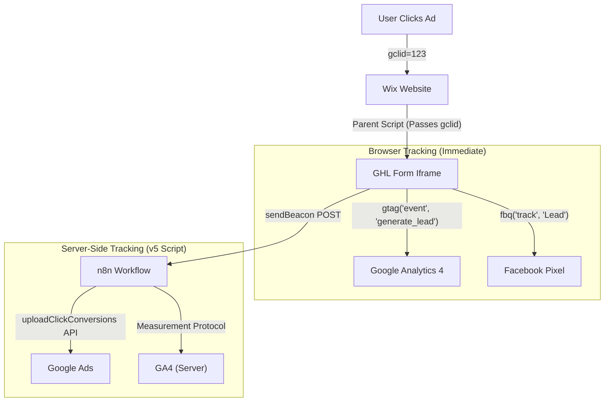

# NMD Law Group - Tracking & Analytics Setup

**Client:** NMD Law Group
**Website:** `nmdlawgroup.com` (Wix)
**CRM:** GoHighLevel (GHL)
**Status:** ✅ Fixed and Active (2025-12-04)

---

## Current Status

### All Systems Operational ✅
- ✅ n8n Workflow `dGa2mc7hONa2KAXV` active (version 45)
- ✅ GHL Form Webhook receives data from v5 script
- ✅ GHL Pipeline Webhook receives pipeline changes
- ✅ "Normalize Form Data" node - uses `simpleHash()` (no crypto error)
- ✅ "Normalize Pipeline Data" node - uses `simpleHash()` (no crypto error)
- ✅ "GA4 - Lead Event" node - API secret hardcoded (`Ms45lyktQ3Cab4CeZ2b7Yg`)
- ✅ Google Ads API upload executes (with valid GCLIDs)
- ✅ sendBeacon from browser to n8n works

### Fixes Applied (2025-12-04)
1. ✅ **"Normalize Pipeline Data" node** - replaced `require('crypto')` with inline `simpleHash()`
2. ✅ **"GA4 - Lead Event" node** - hardcoded API secret `Ms45lyktQ3Cab4CeZ2b7Yg`
3. ✅ **"Normalize Form Data" node** - already fixed (uses `simpleHash()`)

### Next Steps (Monitoring)
1. Wait 24-48 hours for Google Ads to process conversions
2. Verify conversions appear in Google Ads dashboard
3. Test end-to-end with a REAL GCLID from an actual ad click

---

## 1. Architecture Overview

We have implemented a robust **Hybrid Tracking System** that captures data both client-side (Browser) and server-side (n8n). This ensures 100% data accuracy even with ad blockers or cookie rejection.



---

## 2. The "Iframe Solution" (v5 Script)

The core challenge was passing the Google Click ID (`gclid`) from the main Wix website into the embedded GoHighLevel iframe. We solved this with a **Parent-Child Communication Bridge + sendBeacon**.

### How v5 Script Works
1. User lands on page with `?gclid=XXX`
2. Script stores GCLID in localStorage
3. On form submit, script:
   - Fires GA4 `generate_lead` event (client-side)
   - Fires FB Pixel `Lead` event (client-side)
   - Sends GCLID + form data to n8n via `sendBeacon` POST

### Key File
**`scripts/ghl_form_tracking_snippet.html`** - The complete tracking code for GHL forms

### Webhook Endpoint
```
POST https://phpstack-1370137-5762452.cloudwaysapps.com/webhook/nmd-form-submission
```

Payload format:
```json
{
  "gclid": "EAIaIQobChMI...",
  "email": "user@example.com",
  "phone": "+4512345678",
  "first_name": "John",
  "last_name": "Doe",
  "type": "gclid_enrichment",
  "source": "ghl_form_v5_enrichment",
  "timestamp": "2025-12-03T22:33:00Z"
}
```

---

## 3. n8n Workflow (The Backend)

**Workflow Name:** `NMD Law Group - Offline Conversions`
**ID:** `dGa2mc7hONa2KAXV`

### Webhooks
| Endpoint | Purpose |
|----------|---------|
| `/webhook/nmd-form-submission` | Receives form submissions + GCLID enrichment |
| `/webhook/nmd-pipeline-change` | Receives pipeline stage changes from GHL |

### Flow
1. **GHL Form Webhook** → Receives POST data
2. **Normalize Form Data** → Detects if `type: gclid_enrichment` and processes accordingly
3. **Has GCLID?** → Routes to Google Ads upload (true) or Enhanced Conversions (false)
4. **Google Ads - Lead Conversion** → Uploads to Google Ads API v19
5. **GA4 - Lead Event** → Sends server-side event via Measurement Protocol

### Conversion Actions
| Action | ID | Purpose |
|--------|-----|---------|
| Lead Form Submission | `7403121584` | Initial lead capture |
| Qualified Lead | `7403121827` | When deal moves to qualified stage |

---

## 4. Google Tag Manager (GTM)

**Container:** `GTM-KZXHBNVN`

GTM handles standard page tracking on the main Wix site:
*   **Tags:**
    *   `GA4 Configuration`
    *   `Facebook Pixel - Base Code` (PageView)
    *   `Facebook Pixel - Lead` (Fires on form submit event)
    *   `Custom HTML - Store GCLID` (Persists GCLID in cookies)

---

## 5. Verification Steps

To verify the setup is working:

1.  **Open Incognito Window.**
2.  **Simulate Ad Click:** Append `?gclid=TEST_VERIFICATION_123` to the URL.
    *   `https://www.nmdlawgroup.com/kontaktos?gclid=TEST_VERIFICATION_123`
3.  **Submit the Form.**
4.  **Check Console:** You should see:
    *   `[NMD v5] Beacon sent: success`
    *   `[NMD v5] Sent GA4 generate_lead event`
    *   `[NMD v5] Sent FB Lead event`
5.  **Check n8n Executions:**
    *   Workflow should execute with status "success"
    *   Google Ads node will show `UNPARSEABLE_GCLID` error (expected for fake GCLIDs)
6.  **For Real Test:** Use actual GCLID from a real ad click

---

## 6. Key Files & Scripts

| File | Purpose |
|------|---------|
| `scripts/ghl_form_tracking_snippet.html` | **CRITICAL:** v5 tracking code for GHL Form |
| `scripts/setup_nmd_gtm.py` | Python script to configure GTM programmatically |
| `documentation/walkthrough_offline_conversions.md` | Step-by-step setup guide |

---

## 7. Credentials & IDs

| Resource | ID |
|----------|-----|
| Google Ads Customer ID | `7562650658` |
| Google Ads MCC (Login) | `8959543272` |
| GA4 Measurement ID | `G-GMJZFFYVF7` |
| Facebook Pixel ID | `1642362299753454` |
| GTM Container | `GTM-KZXHBNVN` |
| GHL Location ID | `88ZUgqtI55IjCFx38ILm` |
| n8n Workflow ID | `dGa2mc7hONa2KAXV` |

---

## 8. Troubleshooting

### "Cannot find module 'crypto'" error in n8n
The Code nodes use `require('crypto')` which doesn't work in n8n. Replace with simple hash function or use n8n's built-in crypto helpers.

### GCLID rejected by Google Ads
- Fake/test GCLIDs will always be rejected
- GCLIDs expire after 90 days
- Must be from actual ad clicks

### sendBeacon shows success but no n8n execution
- Check if workflow is active (toggle on/off in n8n UI)
- Webhooks need UI toggle to register after API updates

### GA4 Lead Event returns empty
- Check if `GA4_API_SECRET` environment variable is set in n8n
- Or hardcode the API secret directly in the node
